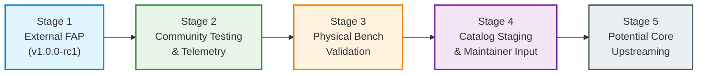

# Battery Guardian — Contribution Strategy & Ecosystem Roadmap

This document outlines the staged strategy for introducing Battery Guardian to the Flipper Zero developer community and ecosystem maintainers.

---

## 1. Guiding Philosophy: Respect the Firmware Core

Flipper's official [Contributing Guidelines](https://github.com/flipperdevices/flipperzero-firmware/blob/dev/CONTRIBUTING.md) emphasize caution when proposing core firmware changes:
> *"Firmware flash space and RAM are strictly limited. Many useful ideas can be implemented as external applications and distributed through the App Catalog rather than added directly to firmware."*

Battery Guardian embraces this philosophy. Rather than submitting an intrusive pull request to `flipperzero-firmware` attempting to overhaul the internal power service, Battery Guardian is developed, hardened, and packaged as a **self-contained external application (`.fap`)**.

---

## 2. Multi-Stage Contribution Progression

### Stage 1: External FAP Release Candidate (Current Milestone)
- **Status:** **COMPLETE (`v1.0.0-rc1`)**
- **Objective:** Freeze core software architecture, complete comprehensive 118-test suite, enforce passive fail-closed charger HAL, and deliver ecosystem-grade documentation.
- **Output:** Independent repository with verified ARM binary build, host test runner, and review artifacts.

### Stage 2: Community Testing & Observability Staging
- **Objective:** Solicit initial community testing from Flipper power users, hardware tinkerers, and developers.
- **Scope:**
  - Users install `battery_guardian.fap` manually to `SD Card/apps/Tools/`.
  - Validate UI rendering across various official and community firmware forks.
  - Collect user reports on discharge session tracking and confidence model behavior.
  - Test robustness of journal storage across diverse microSD card brands and capacities.

### Stage 3: Physical Hardware Bench Validation
- **Objective:** Execute protocols **B-01 through B-06** defined in [HARDWARE_VALIDATION.md](HARDWARE_VALIDATION.md) on real test benches.
- **Scope:**
  - Use programmable battery simulator, 6.5-digit DMM, and digital storage oscilloscope.
  - Log measured electrical transients and register states using [HARDWARE_EVIDENCE_TEMPLATE.md](HARDWARE_EVIDENCE_TEMPLATE.md).
  - Verify that active charge suppression (`furi_hal_power_suppress_charge_enter()`) executes safely without electrical resonance, voltage spikes, or task deadlocks.

### Stage 4: Flipper Apps Catalog Submission
- **Objective:** Submit Battery Guardian to the official `flipper-application-catalog`.
- **Scope:**
  - Submit pull request containing manifest, icon, and catalog metadata per [CATALOG_SUBMISSION.md](CATALOG_SUBMISSION.md).
  - Provide maintainers with complete test evidence, code review logs, and hardware gap analysis.
  - Keep production release in passive mode (or opt-in experimental active control) based on maintainer consensus.

### Stage 5: Potential Upstreaming of Core Modeling
- **Objective:** If requested by Flipper core maintainers, extract the pure mathematical capacity estimation and confidence engine into core firmware services.
- **Scope:**
  - Port `phase2/estimator.c` and `phase2/confidence.c` into `applications/services/power/` to provide background health calculations for the device status bar or battery settings.
  - Leave full graphical analytics, historical graphing, and journal exploration inside the external FAP to conserve core firmware flash space.

---

## 3. Maintenance Policy & Change Control

Following Phase 6 completion:
1. **Zero Unsolicited Architecture Churn:** Core algorithms, state machines, and data formats are permanently frozen.
2. **Acceptance Criteria for Changes:** Only pull requests addressing confirmed bugs, platform SDK updates, hardware validation findings, or maintainer review comments will be accepted.
