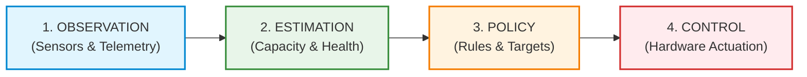

# Battery Guardian — Problem Statement & Conceptual Boundary

## 1. Problem Overview

Handheld embedded devices like the Flipper Zero rely on rechargeable Lithium-ion (Li-ion) battery chemistry. While the hardware includes dedicated power management ICs (PMIC) and fuel gauge ICs, user-facing battery status in embedded operating systems is predominantly reduced to a single, momentary metric: **State of Charge percentage ($\text{SOC}\%$)**.

Relying solely on momentary $\text{SOC}\%$ obscures the physical reality of the battery, creates false precision, and fails to protect cell longevity over time. **Battery Guardian** addresses the fundamental gap between raw instantaneous sensor readings and actionable, long-term battery health intelligence.

---

## 2. Why Raw Battery Percentage Is Insufficient

### 2.1 Voltage Depression and Internal Resistance ($IR$)
Instantaneous battery voltage varies dramatically depending on instantaneous load (radio transmission, screen backlight, SD card writes, CPU frequency changes). As a cell ages, its internal resistance increases ($\Delta V = I \cdot R_{\text{int}}$), causing acute voltage drops during current spikes. Standard voltage-lookup algorithms misinterpret this temporary depression as a drop in remaining energy.

### 2.2 Fuel Gauge Drift and Aging Blind Spots
Fuel gauge lookup tables are factory-calibrated to a pristine, nominal cell (e.g. 2100 mAh at 25°C). As the battery undergoes chemical degradation, SEI layer growth, and active material loss, the true full-charge capacity ($\text{FCC}$) shrinks. A gauge operating on factory tables reports $100\%$ when the cell reaches $4.2\text{V}$, even if the physical capacity has degraded to $1400\text{mAh}$ (66% health). The user experiences rapid, unpredictable shutdowns despite high reported percentages.

### 2.3 Thermal Effects
Lithium-ion electrochemical kinetics slow down at low temperatures ($<10^\circ\text{C}$), temporarily elevating internal resistance and reducing deliverable capacity. High temperatures ($>40^\circ\text{C}$) accelerate chemical aging and risk thermal runaway during charging. A simple percentage tells the user nothing about whether charging or operating under current thermal conditions is degrading the cell.

---

## 3. The Conceptual Boundary: Four Strictly Separated Domains

To prevent architectural confusion, false claims, and safety hazards, Battery Guardian establishes a strict distinction between four domains:

These four domains must **never be conflated**:

### 1. OBSERVATION (Physical Sensor Telemetry)
- **Definition:** Reading raw analog-to-digital converter (ADC) and fuel gauge registers, validating electrical plausibility, converting units into normalized physical SI units ($V, A, ^\circ C, \%,\text{ms}$), and recording them to an append-only journal.
- **Scope:** Pure fact gathering. No decisions, no capacity claims, no hardware manipulation.
- **Failure Mode:** Sensor disconnect, $I^2C$ bus failure, out-of-bounds reading $\to$ Flagged as `TelemetryState: Fault` or `Partial`.

### 2. ESTIMATION (Mathematical & Statistical Inference)
- **Definition:** Analyzing historical sessions across qualifying discharge cycles ($\Delta\text{SOC} \ge 15\%$), integrating Coulombic current ($\int I \, dt$), applying statistical outlier rejection (median filtering), and computing long-term degradation trend slope.
- **Scope:** Pure mathematical modeling.
- **Key Invariant:** Every estimate must carry an explicit **Confidence Score** (`High`, `Medium`, `Low`, `Insufficient`). An uncorroborated single discharge cycle must never be presented as authoritative health.
- **Failure Mode:** Insufficient qualifying sessions, erratic data $\to$ Downgrades confidence score to `Insufficient` and displays `ESTIMATING...` or `REALITY (WAIT)`.

### 3. POLICY (Operational Decision Rules)
- **Definition:** Evaluating user preferences (e.g. `BALANCED` 80% ceiling, `LIFESPAN` 60% ceiling, `FULL` 100%) against current observation and battery health. Determining whether charging *should* be allowed or suppressed, including hysteresis windows and safety lockouts.
- **Scope:** Pure logical evaluation. Produces desired state: `CHARGING_ALLOWED`, `CHARGE_SUPPRESSED`, `SAFETY_LOCKOUT`, `UNMANAGED`.
- **Key Invariant:** Safety rules override user policies unconditionally (e.g. over-temperature or out-of-bounds voltage immediately forces `SAFETY_LOCKOUT`).

### 4. CONTROL (Physical Hardware Actuation)
- **Definition:** Writing to PMIC registers (e.g. BQ25896 charge enable bits or calling platform power suppression APIs).
- **Scope:** Direct physical hardware manipulation.
- **Current Release Status:** **PASSIVE / FAIL-CLOSED**.
- **Crucial Boundary:** In `v1.0.0-rc1`, the control layer is strictly passive. It simulates and logs what actuation would occur, but does NOT write to PMIC registers. Software validation of Policy does NOT equal physical validation of Control.

---

## 4. Why Historical Evidence & Confidence Scoring Matter

### 4.1 Single-Session Fragility
A single battery discharge session can be distorted by:
- Incomplete discharge windows (e.g. 5% drop).
- Sudden temperature changes altering cell impedance.
- Interrupted or staggered usage.

Computing capacity from a single session yields high variance. Battery Guardian requires **at least 3 qualifying sessions** ($\ge 15\%$ drop without thermal excursions) before presenting an observed capacity figure.

### 4.2 Multi-Factor Confidence Scoring
Presenting a definitive health percentage without a confidence measure is misleading. Battery Guardian evaluates:
1. **Sample Quantity:** Number of qualifying sessions recorded in history ring buffer.
2. **Cumulative $\Delta\text{SOC}$:** Total percentage span observed across sessions.
3. **Statistical Dispersion:** Variance among candidate capacity estimates.
4. **Data Freshness:** Age of historical data (penalizing models un-updated for $>30$ days).

---

## 5. Why Formal Safety State Machines Matter

Embedded power systems operate in uncontrolled physical environments. A simple `if (soc > 80) stop_charging();` is unsafe:
- **Cycling near target:** Without hysteresis, the battery oscillates around 80%, toggling PMIC switches dozens of times per minute.
- **USB disconnection:** If the user unplugs USB, software must immediately transition to an unmanaged state and reset suppression state so normal charging resumes on the next plug-in.
- **Sensor loss:** If the fuel gauge stops responding, software cannot safely manage charging. It must enter a latching safe state rather than assuming last-known values.

Battery Guardian models charge safety as a formal, deterministic finite state machine (FSM) with explicit inputs, deterministic transitions, and exhaustive safety lockouts.

---

## 6. Summary of Architectural Guarantees

| Requirement | Traditional Battery App | Battery Guardian |
|---|---|---|
| Health Metric | Static factory lookup table | Dynamic Coulombic integration |
| Outlier Rejection | None (accepts all points) | Median filter over 16-session history |
| Confidence Indication | None (false certainty) | Explicit multi-factor confidence rating |
| Storage Resilience | None or plain text | Append-only binary journal with CRC32 |
| Safety Architecture | Ad-hoc conditional checks | Formal FSM with passive fail-closed HAL |
| Hardware Boundary | Assumed safe | Explicitly separated: Observation vs Control |
