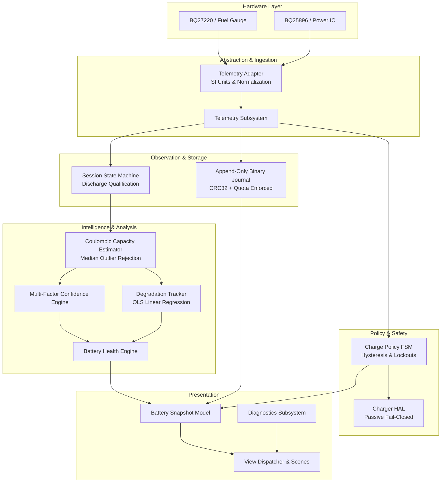

# Battery Guardian for Flipper Zero

[](application.fam)
[](tests/)
[](tests/simulation/)
[](HARDWARE_VALIDATION.md)
[](LICENSE)

**Battery Guardian** is an embedded battery intelligence, telemetry observation, capacity estimation, and safety policy state machine application for the **Flipper Zero**.

Battery Guardian is **not** a trivial battery percentage display app. Instead, it provides an end-to-end telemetry and analytical observability architecture:
- **Continuous Telemetry Observation:** Captures and normalizes physical SI signals (voltage, current, temperature, state-of-charge) across an explicit platform adapter boundary.
- **Session-Aware Capacity Learning:** Discards single-point voltage heuristics in favor of Coulombic integration ($\int I \, dt$) over qualified discharge sessions.
- **Statistical Filtering & Confidence Scoring:** Applies median filtering over historical sessions and computes multi-factor confidence ratings (`High`, `Medium`, `Low`, `Insufficient`) before presenting health estimates.
- **Long-Term Degradation Tracking:** Derives capacity loss trajectories using numerical Ordinary Least Squares (OLS) linear regression.
- **Crash-Resilient Persistent Journaling:** Implements an append-only binary journal with per-record CRC32 verification, 64-bit file offset streaming recovery, and a hard 512 KB storage quota.
- **Formal Safety State Machine:** Evaluates charge protection policies (`BALANCED`, `LIFESPAN`, `FULL`, `CUSTOM`) with hysteresis guards and latching sensor lockouts.
- **Passive Fail-Closed Hardware Boundary:** Built with a strict Hardware Abstraction Layer (HAL) that executes in a passive, fail-closed configuration (zero PMIC register writes in production builds) until physical bench validation is performed.

---

## Technical Scope & Architecture



---

## Four Strictly Separated Domains

To prevent ambiguity and maintain electrical safety, the project separates:
1. **OBSERVATION:** Reading raw sensors, validating physical plausibility, converting to SI units.
2. **ESTIMATION:** Inferring true cell capacity and degradation slope across qualifying historical sessions.
3. **POLICY:** Evaluating desired operational states (target thresholds, hysteresis windows, lockouts).
4. **CONTROL:** Physical actuation on PMIC registers. *(Currently strictly PASSIVE and FAIL-CLOSED)*.

For detailed analysis, see [PROBLEM_STATEMENT.md](PROBLEM_STATEMENT.md).

---

## Safety & Hardware Boundary

> [!WARNING]
> **Physical Hardware Validation: NOT PERFORMED**
>
> Battery Guardian v1.0.0-rc1 is compiled in a strictly **PASSIVE and FAIL-CLOSED** configuration:
> - The production charger HAL does **not** advertise `CHARGER_CAP_CHARGE_CONTROL`.
> - Zero register writes are performed to the BQ25896 PMIC or hardware charging registers.
> - Any charge suppression command is refused at the HAL layer, logging a warning and maintaining factory unmanaged charging.
> - Software simulation and fuzzing prove mathematical and state machine invariants, but do NOT prove physical electrical safety. Physical bench validation (documented in [HARDWARE_VALIDATION.md](HARDWARE_VALIDATION.md)) must be conducted before active hardware charge control is enabled.

---

## Test & Verification Matrix

The codebase is backed by an automated host verification harness and target cross-compilation pipeline:

```
Phase 1 (Core Pipeline & Journal):             23/23 PASS
Phase 2A (Health & Capacity Intelligence):      39/39 PASS
Simulation Datasets (Synthetic Hardware-Less):  10/10 PASS
Phase 2B (Charge Policy & Safety Machine):      20/20 PASS
Phase 3 (Storage & Numerical Hardening):         6/6  PASS
Permanent Regression Suite (REG_01 - REG_05):    5/5  PASS
Phase 4 (Platform Adapter & Hardware HAL):       8/8  PASS
Phase 5 (Security Audit & Adversarial Fuzz):     7/7  PASS
------------------------------------------------------------
Total Unit & Integration Tests:                118/118 PASS
Property Fuzz State Transitions:             100,000 PASS
ARM FAP Compilation (Target 7, API 87.1):      CLEAN (0 warnings)
```

---

## Quick Start

### 1. Host Test Suite & Validation
Requires Python 3.8+ and a C99 compiler (Zig 0.13, Clang, or GCC):
```bash
# Execute the comprehensive test suite
python tests/run_tests.py
```

### 2. Compile FAP for Flipper Zero
Requires [ufbt (Micro Flipper Build Tool)](https://github.com/flipperdevices/flipperzero-ufbt):
```bash
ufbt clean
ufbt
# Output binary: dist/battery_guardian.fap
```

---

## Documentation Navigation

- **Reviewer & Community Guide:**
  - [REVIEW.md](REVIEW.md) — Guided walkthrough for external reviewers and maintainers.
  - [PROBLEM_STATEMENT.md](PROBLEM_STATEMENT.md) — Why raw battery percentage is insufficient & the 4-domain model.
  - [ENGINEERING_NOVELTY.md](ENGINEERING_NOVELTY.md) — Technical novelty audit with evidential classifications.
  - [QUESTIONS_FOR_REVIEW.md](QUESTIONS_FOR_REVIEW.md) — Actionable technical questions for Flipper firmware maintainers.
  - [CONTRIBUTION_STRATEGY.md](CONTRIBUTION_STRATEGY.md) — Staged roadmap from external FAP to ecosystem integration.
- **Architecture & Design:**
  - [ARCHITECTURE.md](ARCHITECTURE.md) — Threading, lock hierarchy, adaptive sampling, and data flow.
  - [SAFETY.md](SAFETY.md) — Formal safety state machine, lockout triggers, and fail-safe transitions.
  - [DATA_FORMAT.md](DATA_FORMAT.md) — Binary journal layout, CRC framing, and recovery mechanics.
- **Verification & Hardware Readiness:**
  - [TEST_MATRIX.md](TEST_MATRIX.md) — Traceable matrix of all 118 tests and 100k fuzz transitions.
  - [HARDWARE_GAP_ANALYSIS.md](HARDWARE_GAP_ANALYSIS.md) — Subsystem audit of software vs physical verification status.
  - [HARDWARE_VALIDATION.md](HARDWARE_VALIDATION.md) — Bench test protocols (B-01 through B-06) for physical hardware.
  - [HARDWARE_EVIDENCE_TEMPLATE.md](HARDWARE_EVIDENCE_TEMPLATE.md) — Standardized test report form.
- **Ecosystem & Packaging:**
  - [CATALOG_SUBMISSION.md](CATALOG_SUBMISSION.md) — Metadata for eventual Flipper Apps Catalog submission.
  - [SCREENSHOT_PLAN.md](SCREENSHOT_PLAN.md) — Specifications for UI documentation captures.
  - [RELEASE_NOTES.md](RELEASE_NOTES.md) — Full v1.0.0-rc1 release notes and integrity checksums.
  - [SECURITY.md](SECURITY.md) — Responsible disclosure protocol and security policy.

---

## License

This project is licensed under the MIT License — see the [LICENSE](LICENSE) file for details.
