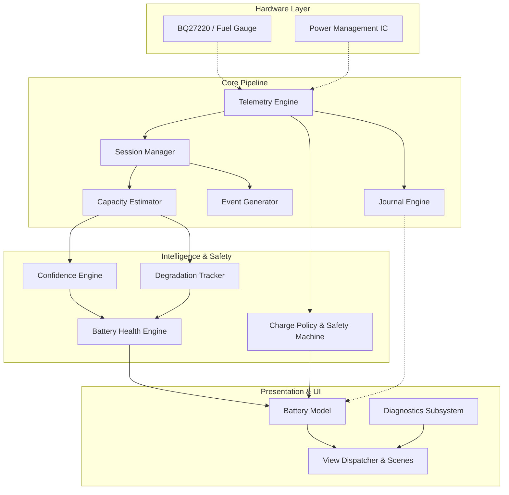

# Battery Guardian for Flipper Zero

[](application.fam)
[](tests/)
[](tests/simulation/)
[](SAFETY.md)
[](LICENSE)

**Battery Guardian** is a production-grade battery intelligence, telemetry tracking, and charge safety guardian application for the **Flipper Zero**.

Unlike the stock fuel gauge, which relies on momentary voltage readings and pre-programmed lookup tables that fail to reflect aged or swollen cells, Battery Guardian executes an ongoing physical model of the battery:
- Integrates actual Coulombic energy across discharge cycles
- Filters out sensor noise and temperature anomalies
- Rejects statistical outliers using median filtering
- Computes multi-session degradation trends using linear regression
- Houses a simulated charge policy engine with fail-safe state machines

---

## Key Features

1. **Adaptive Telemetry Sampling**:
   - Dynamic sampling intervals (5s charging, 10s discharging/active, 30s idle, 1s anomaly).
   - Strict 64-bit monotonic timekeeping resilient across 32-bit tick wrap-arounds (~49.7 days).

2. **Hardened Binary Journal Storage**:
   - Crash-resilient append-only binary journal with per-record CRC32 checksums.
   - Self-healing recovery mechanism with atomic truncation of corrupted byte streams.
   - Enforced 512 KB quota (`JOURNAL_MAX_FILE_SIZE`) with RAM ring-buffer sample eviction.
   - Forward format version validation protecting against incompatible schema corruption.

3. **Phase 2A Intelligence Engine**:
   - Robust capacity estimation based on Coulombic integration over qualified SOC windows ($\ge 15\%$).
   - Statistical median filtering over bounded history rings (16 sessions).
   - Multi-factor confidence scoring (High, Medium, Low, Insufficient) evaluating sample count, SOC span, and noise.
   - Long-term degradation tracking with linear regression slope and confidence bounds.

4. **Phase 2B Charge Policy & Safety Engine**:
   - Configurable charging policies: `BALANCED` (80% target), `LIFESPAN` (60% target), `FULL` (100%), and `CUSTOM`.
   - Built-in hysteresis prevention to eliminate charge-cycle oscillations.
   - Complete fail-safe transitions (USB disconnect, gauge failure, out-of-bounds voltage/temperature).

5. **Diagnostic Observability & Rich UI**:
   - Comprehensive multi-scene user interface: Dashboard, Health Insights, Sessions, History, Explanation, Diagnostics, Menu.
   - Real-time diagnostics view tracking valid/invalid samples, completed sessions, and safety lockout events.

---

## Safety & Hardware Boundaries

> [!IMPORTANT]
> **Hardware Validation Notice**: Hardware validation on physical Flipper Zero hardware has **NOT BEEN PERFORMED**.
> In production firmware builds, all charge-control actuation functions (`core/charger_hal.c`) are configured as **passive logging stubs** (`FURI_LOG_W`). The application executes the complete state machine and policy engine safely without issuing direct register write calls to `furi_hal_power_*`.
> 
> See [SAFETY.md](SAFETY.md) for the complete safety architecture and deployment guidelines.

---

## Architecture Overview



---

## Getting Started

### Prerequisites
- **Host Testing**: Python 3.8+ and [Zig Compiler](https://ziglang.org/) (for C99 host compilation).
- **Target Building**: [ufbt (Micro Flipper Build Tool)](https://github.com/flipperdevices/flipperzero-ufbt).

### Running Host Test Suite
```bash
# Run the 103 unit, integration, simulation, and regression tests
python tests/run_tests.py
```

### Compiling FAP for Flipper Zero
```bash
# Clean and compile target application package
ufbt clean
ufbt
# Output binary: dist/battery_guardian.fap
```

---

## Documentation

- [ARCHITECTURE.md](ARCHITECTURE.md) - Deep architectural breakdown of modules, threading, and data flow.
- [BUILD.md](BUILD.md) - Complete instructions for host testing and ARM FAP compilation.
- [TESTING.md](TESTING.md) - Validation matrix, synthetic datasets, fuzzing methodology, and permanent regression suite.
- [DATA_FORMAT.md](DATA_FORMAT.md) - Binary journal format specification, headers, and record structures.
- [SAFETY.md](SAFETY.md) - Safety state machine, fail-safe boundaries, and hardware interface constraints.
- [DEVELOPMENT.md](DEVELOPMENT.md) - Coding standards, invariants, contribution workflow, and PR checklist.
- [CHANGELOG.md](CHANGELOG.md) - Historical development log from Phase 1 prototype to v1.0.
- [LICENSE](LICENSE) - MIT License.
